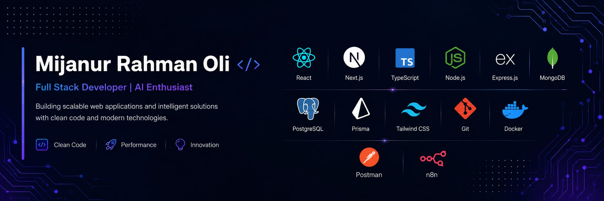

  

# Hi, I'm Mijanur Rahman Oli 👋

## About Me

I am a results-oriented **Full Stack Developer** bringing 2+ years of professional software engineering experience. My passion lies in eliminating architectural complexity with clean, type-safe, business-driven codebases built to handle enterprise demands. 

- 💼 **Professional Track:** Proven history delivering technical value, including a Software Developer Internship at **Itransition** and driving high-level operations and system architecture at **Meson**.
- 🔭 **Currently Building:** High-compliance enterprise SaaS infrastructure, scalable multi-tenant architectures, and real-world productions using the modern stack: **Next.js**, **TypeScript**, and **PostgreSQL**.
- 🌱 **Deepening Knowledge:** Transitioning toward advanced **AI Engineering** specifically focusing on AI agent architectures, orchestration workflows, and complex system design.
- 💬 **Expertise:** Ask me about Next.js optimizations, type safety, database schema design, and seamless third-party API integrations.
- 📫 **Get in Touch:** Drop me a line at [sheikhmijanurrahmanoli@gmail.com](mailto:sheikhmijanurrahmanoli@gmail.com)
---

## Featured Projects

<table>
  <tr>
    <td width="50%">
      <h3 align="center"><a href="https://inventory-system-gold-five.vercel.app/">InventoryOS</a></h3>
      

        
        
        
        
      

      
Inventory & operations platform with Odoo and Salesforce API integration, plus real-time chat via Socket.io.

      

        
        
      

    </td>
    <td width="50%">
      <h3 align="center"><a href="https://agrobite.bd">Agrobite</a></h3>
      

        
        
        
        
      

      
Full-stack MERN application built with JavaScript.

      

        
        
      

    </td>
  </tr>
  <tr>
    <td width="50%">
      <h3 align="center"><a href="https://unrivaled-florentine-bff2fc.netlify.app/">ClubSphere</a></h3>
      

        
        
        
        
      

      
Full-stack MERN application built with JavaScript.

      

        
        
      

    </td>
    <td width="50%"></td>
  </tr>
</table>

---

## Tech Stack

**Frontend**

  

**Backend**

  

**Database**

  

**Tools & DevOps**

  

---

## GitHub Activity

  <picture>
    <source media="(prefers-color-scheme: dark)" srcset="https://github-readme-activity-graph.vercel.app/graph?username=mijanur-rahman-oli&custom_title=Contribution%20Graph&bg_color=0D1117&color=61DAFB&line=61DAFB&point=FFFFFF&area_color=61DAFB&area=true&hide_border=true"/>
    <source media="(prefers-color-scheme: light)" srcset="https://github-readme-activity-graph.vercel.app/graph?username=mijanur-rahman-oli&custom_title=Contribution%20Graph&theme=minimal&area=true&hide_border=true"/>
    
  </picture>

 

### Contribution Snake
<picture>
  <source media="(prefers-color-scheme: dark)" srcset="https://raw.githubusercontent.com/mijanur-rahman-oli/mijanur-rahman-oli/output/github-contribution-grid-snake-dark.svg" />
  <source media="(prefers-color-scheme: light)" srcset="https://raw.githubusercontent.com/mijanur-rahman-oli/mijanur-rahman-oli/output/github-contribution-grid-snake.svg" />
  
</picture>

---

## Connect With Me

  

---

  ⭐ Thanks for visiting my profile! Feel free to explore my repositories and reach out if you'd like to collaborate.

